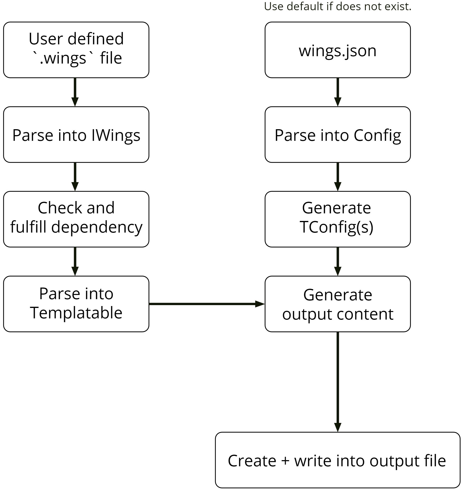

# Design

Here's a diagram for a high level illustration on how the files are generated.

_Note: Intentionally using API doc for linking most of the "[Source]()" since code location might change and API doc will usually automatically update based on that._

### User defined `.wings` file

Reading the user input files.

_[Source](https://wings.sh/main/wingspkg/core.html#fromFiles%2Cseq%5BT%5D%5Bstring%5D%2CConfig)_

### Parse into `IWings`

Parse the wings file into an `IWings` object type.

_[Source](https://wings.sh/main/wingspkg/lib/winterface.html#parseFile%2Cstring%2Cbool)_

### Check and fulfill dependency

After parsing all the wings file and understanding each of their dependencies (wings file does not allow circular dependency), it would start parsing (fulfilling) it from the one that doesn't have dependency and work its way up. If `skipImport` is set to `true` in the config file, it would skip generating output files of the dependencies that isn't included in the CLI argument and goes straight to generating its output filenames (required for next step).

_[Source](https://wings.sh/main/wingspkg/lib/wiutil.html#dependencyGraph%2CTable%5Bstring%2CIWings%5D%2CConfig)_

### Parse into `Templatable`

Once the dependency of the wings file is fulfilled, it can now be parsed to `Templatable` object type. (Dependency needs to be fulfilled first before this step because this step needs the file name / location of the files it depends on which can only be obtained from generating its wings file.)

_[Source](https://wings.sh/main/wingspkg/lib/templatable.html#wingsToTemplatable%2CIWings%2CTConfig)_

### wings.json

Reading the user config file.

_[Source](https://github.com/binhonglee/wings/blob/devel/src/main/wings.nim#L48-L51)_

### Parse into Config

Parse user config file into `Config` object type.

_[Source](https://wings.sh/main/wingspkg/util/config.html#parse%2Cstring)_

### Generate `TConfig`(s)

Based on `Config`, parse each language specific output config file into `TConfig`.

_[Source](https://wings.sh/main/wingspkg/lib/tutil.html#parse%2Cstring)_

### Generate output content

Generate output content by parsing information from `Templatable` based on the format / design specified in `TConfig`.

_[Source](https://wings.sh/main/wingspkg/lib/templating.html#genFile%2CTemplatable%2CTConfig%2CWingsType)_

### Create + write into output file

Create the destination file and folder (if they do not already exist) and write output content into it (overwrite original file content if it exist). If there is a write protected existing file, this step would fail.

_[Source](https://github.com/binhonglee/wings/blob/devel/src/main/wings.nim#L17-L28)_
